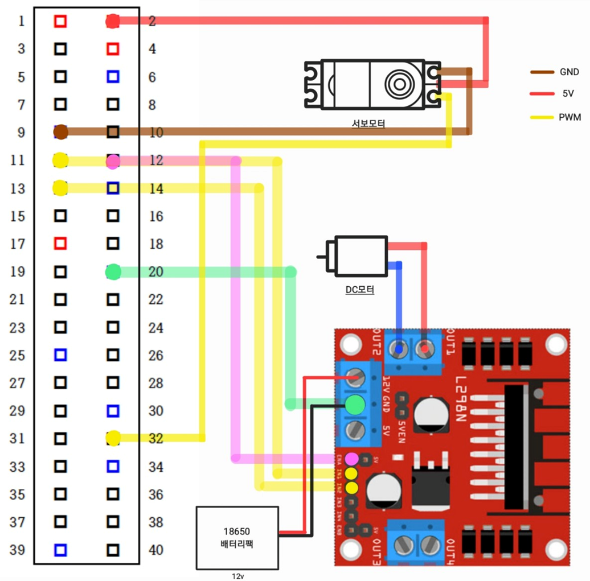

# 自動運転車プロジェクト (Self-Driving RC Car)

ディープラーニングを活用した車線認識およびリアルタイム制御ライントラッキングRC Carプロジェクト

## デモ動画

<p align="center">
  
</p>

## プロジェクト目的

映像を利用した**車線認識**と**リアルタイム制御**のライントラッキングシステム実装

- カメラ映像を入力し、モデルが車線を認識
- 認識結果をもとにサーボモーターの角度をリアルタイム制御
- **ディープラーニング(CNN)を活用した自動運転システム**

## 主要技術

| プラットフォーム | 言語 | DLフレームワーク |
|------------------|------|------------------|
| Raspberry Pi | Python | TensorFlow / Keras |

## 開発期間

**2024年10月6日 〜 12月15日**

- H/W設計および開発環境構築
- 走行アルゴリズム開発、データ収集および前処理
- DLモデルの学習および推論実装

## 技術選定: Raspberry Pi vs Jetson

初期安定性と学習効率を考慮し**Raspberry Pi**を採用

| 比較項目 | Raspberry Pi | Jetson |
|----------|--------------|--------|
| 制御/モデル実行環境構築 | 容易 | 複雑 |
| 導入難易度 | 低い | 高い |
| 資料およびサンプル | 豊富 | 比較的少ない |
| 開発環境構築 | 簡単で迅速 | 時間がかかる |

## プロジェクト構造

```
RC-Car-Project/
├── All_moter_test/     # サーボモーター + DCモーター統合テスト
├── Camera/             # カメラテストコード
├── Data_preprocessing/ # 画像前処理
├── DC/                 # DCモーター制御テスト
├── inference/          # リアルタイム推論
├── learning/           # CNNモデル学習
├── Motor_Camera/       # データ収集（モーター制御 + カメラ）
└── Servo/              # サーボモーター制御テスト
```

---

## プロジェクト実装（第1次試行）

### 1. ハードウェア設計および組立

DL推論環境を考慮した組み込みH/Wシステム設計

- 映像入力およびモーター制御用配線構成
- Raspberry Piおよび周辺機器の接続
- 安定した電源供給構成

→ **リアルタイム走行が可能なH/W環境を構築**

#### 問題状況

ハードウェア配線の経験不足により、一部部品が正常に動作しない問題が繰り返し発生

| 困難だった点 | 解決策 |
|-------------|--------|
| 電圧・電流の流れに対する理解不足による配線ミス | 配線図を自ら設計し、信号の流れを視覚的に整理 |
| 複雑な接続構造を正確に把握することが困難 | 各部品の接続を段階的に確認し、ミスを最小化 |

→ **H/W構造を体系的に整理**する必要性を認識 → **安定したハードウェア接続構成を構築**

#### ハードウェア配線図

<p align="center">
  
</p>

#### 部品リスト
- Raspberry Pi
- USBウェブカメラ
- サーボモーター（ステアリング用）
- DCモーター + L298Nモータードライバー（駆動用）

#### GPIO ピン接続
| 部品 | GPIO ピン |
|------|-----------|
| サーボモーター (PWM) | GPIO 12 |
| DCモーター IN1 | GPIO 17 |
| DCモーター IN2 | GPIO 27 |
| DCモーター ENA (PWM) | GPIO 18 |

### 2. データ収集および前処理

学習用データの収集および前処理を実施

#### データ収集
キーボードでRC Carを手動操縦しながらカメラ画像を自動保存

```bash
python Motor_Camera/Data_collecting_code.py
```

| キー | 動作 |
|------|------|
| ↑ | 前進（速度増加） |
| ↓ | 減速 |
| ← | 左折 |
| → | 右折 |
| Space | 停止 |
| ESC | 終了 |

画像はステアリング角度に応じて `left/`, `straight/`, `right/` フォルダに自動分類

#### ステアリング角度範囲

| 方向 | サーボモーター角度 |
|------|-------------------|
| 左折 (left) | 0° 〜 20° |
| 直進 (straight) | 21° 〜 40° |
| 右折 (right) | 41° 〜 60° |

#### データ前処理
収集した画像を学習に適するよう前処理

```bash
python Data_preprocessing/data_processing.py
```

| 段階 | 処理内容 |
|------|----------|
| 1 | 不要領域の除去（上部30%） |
| 2 | グレースケール変換 |
| 3 | ガウシアンブラー |
| 4 | 二値化（Thresholding） |
| 5 | モデル入力サイズに合わせたリサイズ |

→ **DL学習に適した入力データセットを構築**

### 3. モデル学習

CNNベース自動運転モデルの設計および学習

```bash
python learning/Data_learning.py
```

#### モデル構造
```
Input (64x64x3)
    ↓
Conv2D (32, 3x3) → ReLU → MaxPooling → Dropout(0.25)
    ↓
Conv2D (64, 3x3) → ReLU → MaxPooling → Dropout(0.25)
    ↓
Flatten → Dense (128) → ReLU → Dropout(0.5)
    ↓
Dense (3) → Softmax
    ↓
Output: [left, straight, right]
```

### 4. リアルタイム推論

学習済みモデルをRaspberry Pi環境でリアルタイム推論

```bash
python inference/inference.py
```

---

## 第1次試行結果

### 結果: 失敗

**車線をほとんど認識できず**

### 失敗原因分析

| 問題点 | 説明 |
|--------|------|
| データ量不足 | 学習データが十分でない |
| CPU処理の限界 | Raspberry Pi CPUではリアルタイム推論が困難 |
| 推論エンジン未使用 | モデル最適化なしでraw TensorFlowを使用 |

→ **システム全体の環境改善の必要性**

---

## 再挑戦計画（第2次試行）

### Jetson Nanoを活用した自動運転車

| 改善項目 | 内容 |
|----------|------|
| データ拡張 | 拡張データセットでモデル再学習 |
| GPU加速 | GPUを活用したリアルタイム推論環境構築 |
| モデル最適化 | TensorRT適用で推論速度向上 |

→ **GPU加速環境で再挑戦**

---

## 依存関係インストール

```bash
pip install tensorflow numpy opencv-python scikit-learn pynput RPi.GPIO
```

## 要件

- Python 3.7+
- TensorFlow 2.x
- OpenCV
- Raspberry Pi OS（第1次）/ JetPack（第2次）
